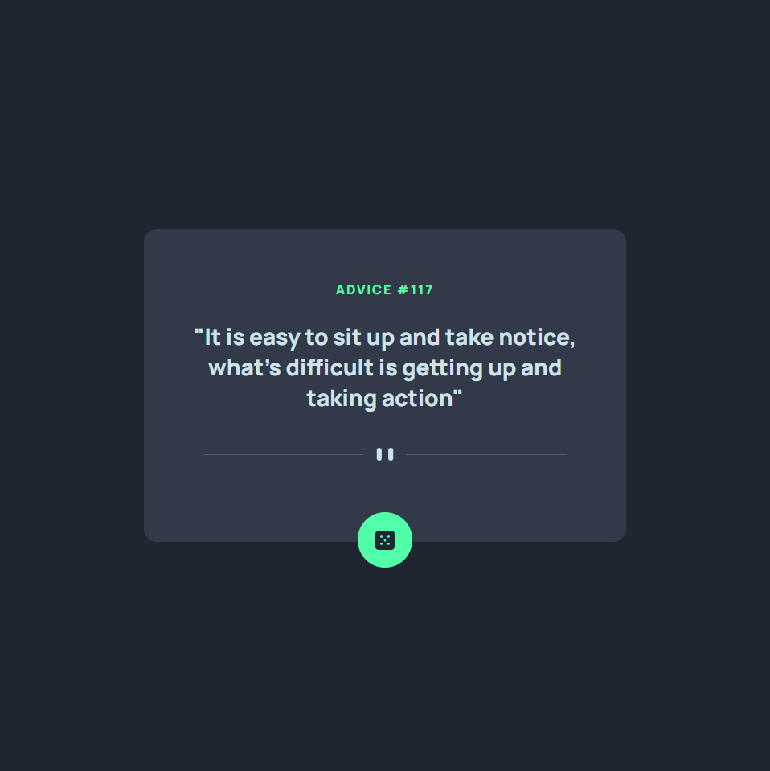

# Frontend Mentor - Advice generator app solution

This is a solution to the [Advice generator app challenge on Frontend Mentor](https://www.frontendmentor.io/challenges/advice-generator-app-QdUG-13db). Frontend Mentor challenges help you improve your coding skills by building realistic projects.

## Table of contents

- [Overview](#overview)
  - [The challenge](#the-challenge)
  - [Screenshot](#screenshot)
  - [Links](#links)
- [My process](#my-process)
  - [Built with](#built-with)
  - [What I learned](#what-i-learned)
  - [Continued development](#continued-development)
- [Author](#author)

## Overview

### The challenge

Users should be able to: Click on the dice button and get a random phrase each time.
- 
### Screenshot



### Links

- Solution URL: [Add solution URL here](https://github.com/nexus122/advice-generator-app-main)
- Live Site URL: [Add live site URL here](https://nexus122.github.io/advice-generator-app-main/)

## My process

### Built with

- Semantic HTML5 markup
- CSS custom properties
- Javascript
- Jquery
- Ajax
- Flexbox
- Mobile-first workflow

### What I learned

With this exercise I have practiced and improved my skills as a layout designer, making use of the flexbox to adapt the web to all types of screen sizes.
And I was able to use :root to create css variables for the colors

To see how you can add code snippets, see below:

```css
/* Colores */
:root{
    /* Primarios */
    --color--primary--1: hsl(193, 38%, 86%);
    --color--primary--2: hsl(150, 100%, 66%); /* Yellow Accent */

    /* Neutrales */
    --color--neutral--1: hsl(217, 19%, 38%);
    --color--neutral--2: hsl(217, 19%, 24%);
    --color--neutral--3: hsl(218, 23%, 16%); 

    /* Tipografia */
    --font-family: 'Manrope', sans-serif;
}
```

In only 26 lines I have managed to create all the interactivity of the page.
```js
/* Creamos un estado para la app */
let state = {
    // DOM
    advice_id_element: document.querySelector("#advice_id"),
    advice_phrase_element: document.querySelector("#advice"),
    button: document.querySelector(".btn"),
    getRandomPhrase(){
        $.ajax({
            type : 'GET',            
            url: "https://api.adviceslip.com/advice",
        }).then(async function(json) {            
            writeData(JSON.parse(json));
        });
    }
};

state.button.addEventListener("click",  function (){
    state.getRandomPhrase();    
});

function writeData(json){
    console.log(json);
    /* Modificamos el Dom */
    state.advice_id_element.innerHTML = "ADVICE #"+json.slip.id
    state.advice_phrase_element.innerHTML = json.slip.advice
}
```
### Continued development

I am interested in learning more about the state of the applications, to have more control of the DOM and the variables that are in play during code execution, which is something I could have used in my previous job.

## Author

- Website - [@nexus122 CV](https://curriculum.juanpabloromeropereira.es/)
- Frontend Mentor - [@nexus122](https://www.frontendmentor.io/profile/nexus122)
- Linkedin - [Juan Pablo Romero Pereira](https://www.linkedin.com/in/juan-pablo-romero-pereira-523996101/)
